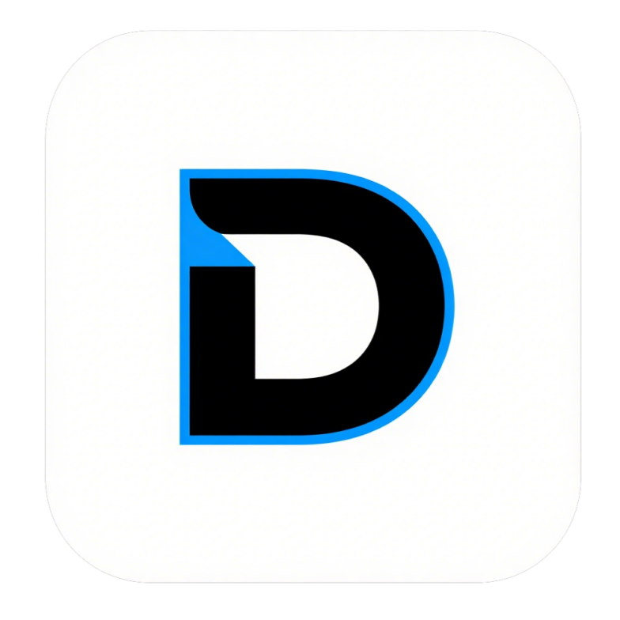
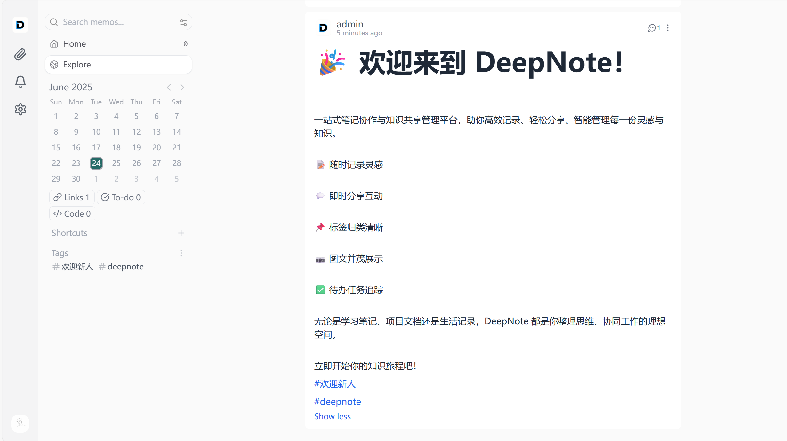

# DeepNote：一站式笔记协作与知识共享管理平台

DeepNote基于Memos，是一个现代的、开源的、自托管的知识管理和笔记平台，专为注重隐私的用户和组织而设计。支持Markdown和捕获、组织、管理你的个人笔记。



## 核心功能
- Markdown格式笔记
- 笔记分享与互动
- 笔记TAG与待办管理
- 笔记相册管理
- 工作区管理
## 快速开始
### 环境要求
- Go 1.24 or later
- Node.js 22+ and pnpm
- Git for version control
### 项目部署
本项目使用go后端和react前端搭建框架，前端使用pnpm管理包，在准备了以上环境之后，项目部署需要进行以下操作
```bash
# go开启国内镜像源
export GO111MODULE=on
export GOPROXY=https://goproxy.cn,direct
go mod tidy
# 或者go mod download

# 前端下载包与运行
cd web
pnpm install
```

### 项目启动
```bash
# 后端运行
go run ./bin/memos/main.go --mode dev --port 8081
# 前端新开一个客户端
cd web
pnpm dev
```
或者，可以使用我们准备的一键部署脚本
```bash
# Windows
./start.bat
```

